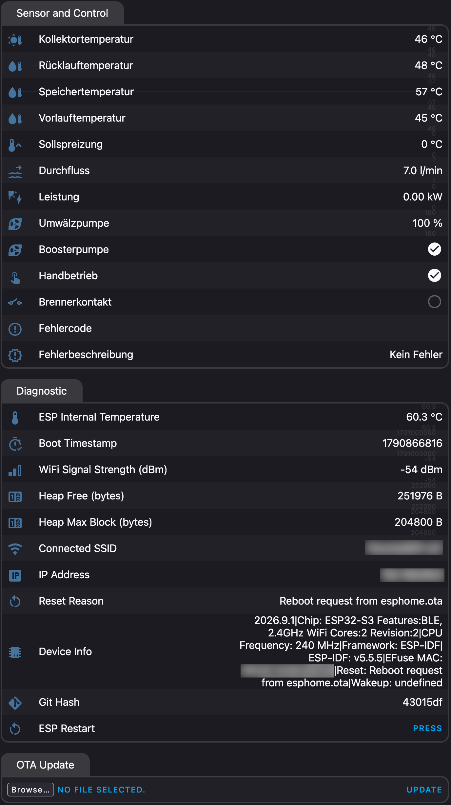
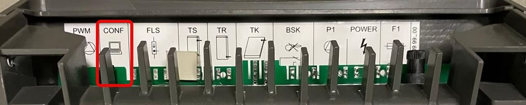
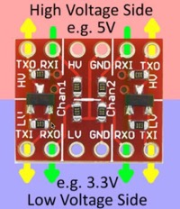
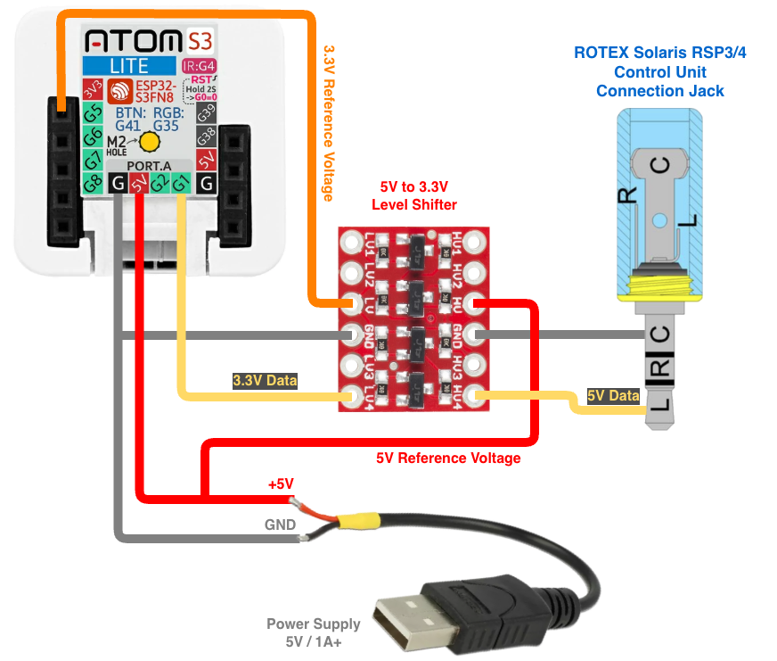
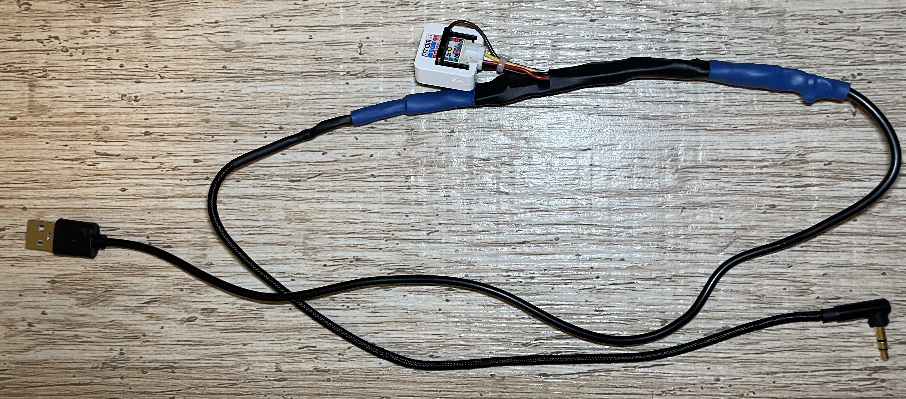
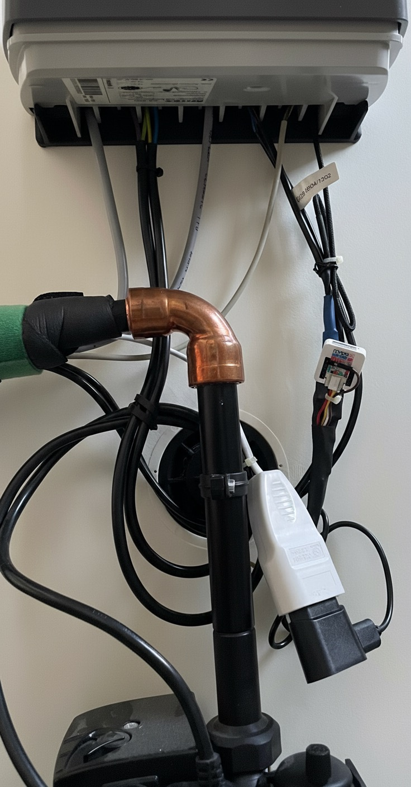
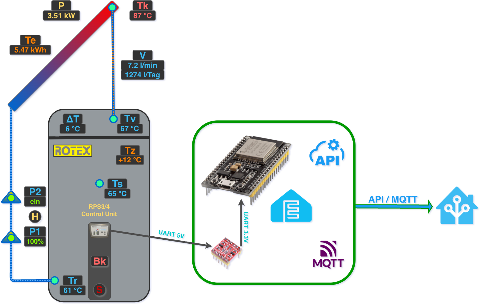

[](README.md)
[](README.en.md)
 
# DAIKIN/ROTEX Solaris RPS3/4 Monitoring

This project makes it possible to monitor DAIKIN/ROTEX Solaris RPS3/4 in Home Assistant (HA) using an ESP32 development board running ESPHome firmware. Any other home automation software with API or MQTT support can be used as well though you need to build the dashboards and the configuration there yourself. Here only HA integration and dashboard is documented.

<p align="center">
  
  
</p>

> [!WARNING]  
> Using `DAIKIN/ROTEX Solaris RPS3/4 Monitoring` can potentially damage your DAIKIN/ROTEX Solaris heating system. <br />
> **Use it at your own risk!** I accept no liability for any resulting damage! <br />
> Please note that using `DAIKIN/ROTEX Solaris RPS3/4 Monitoring` may also void your warranty and manufacturer support!

# What hardware you need?

- ESP32 development board. [M5Stack AtomS3 Lite](https://docs.m5stack.com/en/core/AtomS3%20Lite) is a good choice and I've tested it.
- Power supply for the ESP32 development board. A normal [USB 5V/1A power supply](#usb-power-adapter) can be used.
- [5V to 3.3V level shifter](#5v-to-33v-level-shifter)
- USB Cable (2.0 with only two wires is enough)
- 3.5mm Stereo Jack (preferably 90 degree one)
- Several jumper wires
- Shrink tubing for the cable isolation
- eurosocket extension for the USB power supply

# Hardware Setup & Installation

## USB Power Adapter
It is better to use euro-socket extension and short USB cable instead of vice versa as if the USB cable is too long this will cause voltage drop and will lead to instability of the ESP32. In the box of the DAIKIN/ROTEX Solaris RPS3/4 there is enough space to put the eurosocket and the USB power adapter.

## DAIKIN/ROTEX Solaris RPS3/4 Serial Port Connection
The DAIKIN/ROTEX Solaris RPS3/4 has a 3.5mm stereo jack as serial port and its wires are as follows:

| Solaris RPS3/4 <br /> 3.5mm Jack | Connection  | Description   |
| -------------------------------- | ----------- | ------------- |
| Tip                              | Tx          | Left Channel  |
| Ring                             | Rx          | Right Channel |
| Sleeve                           | GND         | Ground        |

Here is a picture of the location of the serial jack connection on the back of the RPS3/4 control unit:



## 5V to 3.3V Level Shifter
Here is a sample [ST1167 level shifter](https://www.reichelt.de/de/de/shop/produkt/entwicklerboards_-_ttl_logic_level_converter_3_3v_5v-282702) which could be used. It is the [SparkFun 5V to 3.3V level shifter](https://www.sparkfun.com/sparkfun-logic-level-converter-bi-directional.html).



For more information read the [ST1167 manual](manuals/ST1167_Manual.pdf) or read the documents in the SparkFun website linked above. Of course, any other alternative can be used too.

## Wiring Schema
Here is the schema of the wiring between the different components:



## Ready Solution
So it looks like when it is ready:



And here once in the RPS housing:



# Software Setup & Installation

## Overview

The DAIKIN/ROTEX Solaris RPS3/4 data will be sent to HA via local network. There are two options how HA can connect to the ESP32 controller:

- Via HTTP API calls
- MQTT broker like [Mosquitto MQTT](https://mosquitto.org/). You will need to configure HA as described in the [official HA documentation](https://www.home-assistant.io/integrations/mqtt/). You will need also to adapt the ESPHome configuration [solaris-template.yaml](esphome/solaris-template.yaml) to setup the [MQTT client](https://esphome.io/components/mqtt).

The DAIKIN/ROTEX Solaris RPS3/4 sends the complete data separated by semicolons at every configured interval (`cycle /s`). The data is parsed and published to HA by the ESPHome external component.

 

## DAIKIN/ROTEX Solaris RPS3/4 configuration
You must activate the serial communication data output of the RPS3/4 control unit. The default code of the technical user is `0110`. 
After you are logged as technical user with the code, go to `System` -> `Data output` and configure as follows:

| Solaris RPS3/4 | Description |
| -------------- | ----------- |
| Cycle /s       | 5s          |
| Record         | AD-232      |
| Baudrate       | 9600        |
| Address        | 255         |

### Serial data structure

| Metric  | Description                                                                                   | Reference | Type   |
| ------- | --------------------------------------------------------------------------------------------- | --------- | ------ |
| HA      | Manual Operation                                                                              | 1         | bool   |
| BK      | Burner Contact                                                                                | 2         | bool   |
| P1      | Circulation Pump Rate                                                                         | 3         | int    |
| P2      | Booster Pump Enabled                                                                          | 4         | bool   |
| TK      | Collector Temp (°C)                                                                           | 5         | int    |
| TR      | Return Temp (°C)                                                                              | 6         | int    |
| TS      | Storage Temp (°C)                                                                             | 7         | int    |
| TV      | Flow Temp (°C)                                                                                | 8         | int    |
| V       | Flow Rate (l/min)                                                                             | 9         | float  |
| Err     | Error Status (''/K/R/S/V/D/G/F/W)                                                             | 10        | string |
| P       | Power (Watt)                                                                                  | 11        | int    |
| DeltaT¹ | Target spread — target temperature differential TV−TR during modulated operation (calculated) | 12        | int    |
| Zust²   | Operating state: 23 = active solar operation, 21 = standby / no active solar operation        | 13        | int    |

¹ RPS4 only — published as `solaris_deltat`; on RPS3 TV−TR is calculated and published instead.
² RPS4 only — received and logged by the component but not published as a HA sensor.

Error status:

| Error Code | Description                                                                                 | Sensor/Component Affected                                            |
| ---------- | ------------------------------------------------------------------------------------------- | -------------------------------------------------------------------- |
| empty      | no error                                                                                    | System operating normally                                            |
| K          | Kollektortemperatursensor                                                                   | Collector temperature sensor                                         |
| R          | Rücklauftemperatursensor                                                                    | Return temperature sensor                                            |
| S          | Speichertemperatursensor                                                                    | Storage temperature sensor                                           |
| D          | Durchflusssensor                                                                            | Flow rate sensor                                                     |
| V          | Vorlauftemperatursensor                                                                     | Flow temperature sensor                                              |
| G          | A/D Converter Error <br /> Supply Voltage Error <br /> Reference Voltage Error              | N/A                                                                  |
| F/W        | Minimum Flow V1 not reached during startup after 'Time P2' elapsed                          | N/A                                                                  |

## ESPHome

### Preparing the ESPHome YAML Configuration

> [!NOTE]
> [`solaris-template.yaml`](esphome/solaris-template.yaml) and [`secrets-template.yaml`](esphome/secrets-template.yaml) are the committed reference files. Do **not** build them directly — instead copy them to `solaris.yaml` and `secrets.yaml` (both git-ignored local working copies) and adapt those:
> ```bash
> cd esphome
> cp solaris-template.yaml solaris.yaml
> cp secrets-template.yaml secrets.yaml
> ```
> The template pulls the component straight from GitHub via `external_components`. If you are developing the component locally, switch that block to the commented-out local source (`type: local`, `path: components`).

The [solaris-template.yaml](esphome/solaris-template.yaml) need to be adapted to match your hardware setup:

  - Adjust ESP32 device hostname and display name
      ```yaml
      esphome:
        name: esp-rotex-solaris-rps3 # Hostname of the ESP32 device
        friendly_name: "ROTEX Solaris RPS3" # Display name in Home Assistant
      ```

  - Adjust the ESP32 board type accordingly:

      ```yaml
      esp32:
        board: m5stack-atoms3 # For M5Stack AtomS3 - adjust accordingly
        variant: esp32s3
        framework:
          type: esp-idf
      ```

  - Adjust the WiFi domain:

      ```yaml
      wifi:
        ...
        domain: .iot.home.arpa # Change to your domain or remove if none defined
        use_address: xxx.xxx.xxx.xxx # Static IP if no DNS available
        ...
      ```

  - Adjust the used GPIO pin

      ```yaml
      uart:
        id: uart_bus
        rx_pin: GPIO1 # Change to the GPIO pin you choose to use
        baud_rate: 9600 # Lower baud rate for more reliable communication
        parity: NONE # DAIKIN/ROTEX Solaris RPS3/4 uses no parity
      ```

  - Optionally, choose the language for the entity names and error messages. Supported values are `de` (default), `en`, `fr`, `it` and `es`:

      ```yaml
      daikin_rotex_solaris:
        ...
        language: de # de | en | fr | it | es
      ```

  - **RPS4 only:** the RPS4 has no booster pump. Comment out the `solaris_p2` block in `solaris.yaml` and the corresponding `p2_*` rules in the HA dashboard YAML.

### Maintaining the ESPHome Secrets

Maintain the following secrets in `secrets.yaml` (use [`secrets-template.yaml`](esphome/secrets-template.yaml) as the starting point) or in the `SECRETS` section if you use ESPHome Add-on:

  ```yaml
  # ESPHome Secrets
  wifi_ssid: "..."
  wifi_password: "..."
  solaris_ap_fallback_password: "..."
  solaris_encryption_key: "..."
  solaris_web_server_username: "..."
  solaris_web_server_password: "..."
  ``` 

### Compiling and deploying the ESPHome firmware

Compile and deploy the ESPHome firmware from the prepared configuration onto your ESP32 device using your preferred method either by [ESPHome add-on](https://esphome.io/guides/getting_started_hassio), [Web ESPHome](https://web.esphome.io) or [ESPHome CLI](https://esphome.io/guides/getting_started_command_line).

Once the device boots, open `http://<device-ip>` in a browser (credentials from `secrets.yaml`) to verify the device is online and sensors are populating before proceeding to the HA dashboard setup.

## Home Assistant Dashboard

For creating the Solaris RPS3/4 Dashboard, refer to the [README](ha-dashboard/README.en.md) in `ha-dashboard` folder.
