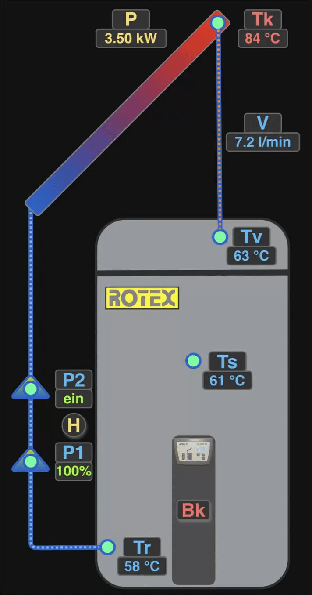
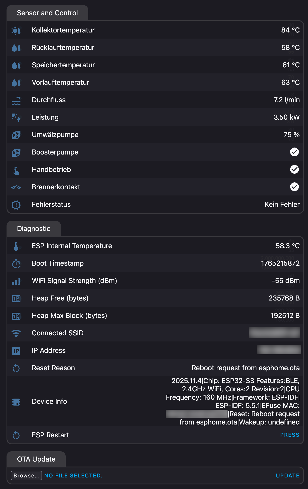
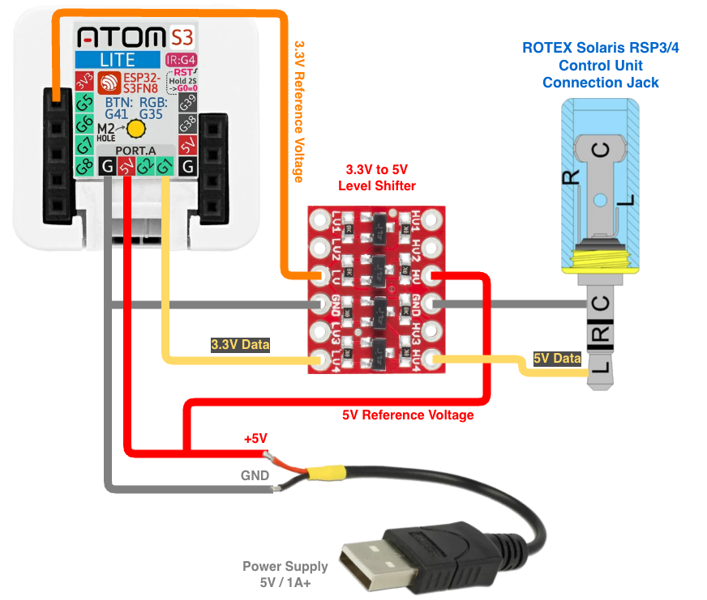
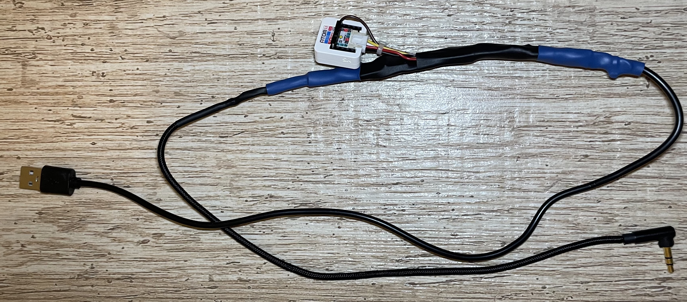
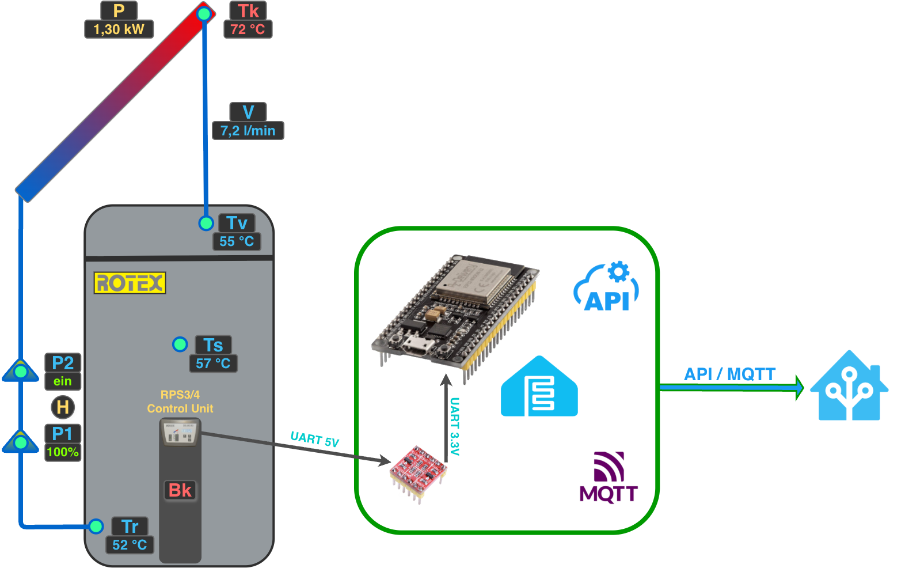

[](README.md)
[](README.en.md)
 
# DAIKIN/ROTEX Solaris RPS3/4 Überwachung

Dieses Projekt ermöglicht die Überwachung von DAIKIN/ROTEX Solaris RSP3/4 in Home Assistant (HA) mithilfe eines ESP32-Entwicklungsboards mit ESPHome-Firmware. Jede andere Hausautomatisierungssoftware mit API- oder MQTT-Unterstützung kann ebenfalls verwendet werden, allerdings müssen Sie die Dashboards und die Konfiguration dort selbst erstellen. Hier werden nur die HA-Integration und das Dashboard dokumentiert.

<p align="center">
  
  
</p>

> [!WARNING]  
> Die Verwendung von `DAIKIN/ROTEX Solaris RPS3/4 Monitoring` kann Ihr DAIKIN/ROTEX Solaris-Heizsystem beschädigen. <br />
> **Die Verwendung erfolgt auf eigene Gefahr!** Ich übernehme keine Haftung für daraus resultierende Schäden! <br />
> Bitte beachten Sie, dass die Verwendung von `DAIKIN/ROTEX Solaris RPS3/4 Monitoring` auch zum Erlöschen Ihrer Garantie und des Hersteller-Supports führen kann!

# Welche Hardware benötigen Sie?

- ESP32-Entwicklungsboard. [M5Stack AtomS3 Lite](https://docs.m5stack.com/en/core/AtomS3%20Lite) ist eine gute Wahl und wurde von mir getestet.
- Stromversorgung für das ESP32-Entwicklungsboard. Ein normales [USB-Netzteil mit 5V/1A](#usb-netzteil) kann verwendet werden.
- [5V auf 3,3V Pegelwandler](#5v-auf-33v-pegelwandler)
- USB-Kabel (2.0 mit nur zwei Adern ist ausreichend)
- 3,5mm Stereo-Klinkenstecker (vorzugsweise 90 Grad)
- Mehrere Überbrückungskabel
- Schrumpfschlauch für die Kabelisolierung
- Eurosteckdosenverlängerung für das USB-Netzteil

# Hardware-Einrichtung und Installation

## USB-Netzteil
Es ist besser, eine Euro-Steckdosenverlängerung und ein kurzes USB-Kabel zu verwenden als umgekehrt, da ein zu langes USB-Kabel zu einem Spannungsabfall und damit zu einer Instabilität des ESP32 führen kann. In der Verpackung des DAIKIN/ROTEX Solaris RSP3/4 ist ausreichend Platz für die Euro-Steckdose und das USB-Netzteil.

## DAIKIN/ROTEX Solaris RSP3/4 Serielle Schnittstelle
Der DAIKIN/ROTEX Solaris RSP3/4 verfügt über eine 3,5mm Stereobuchse als serielle Schnittstelle, deren Anschlüsse wie folgt belegt sind:

| Solaris RSP3/4 <br /> 3,5mm Buchse  | Anschluss   | Beschreibung  |
| ----------------------------------- | ----------- | ------------- |
| Spitze                              | Tx          | Linker Kanal  |
| Ring                                | Rx          | Rechter Kanal |
| Hülse                               | GND         | Masse         |

Hier ist ein Bild der Position des seriellen Anschlusses auf der Rückseite der RSP3/4-Steuereinheit:


## 5V auf 3,3V Pegelwandler
Hier ist ein Beispiel für einen [ST1167 Pegelwandler](https://www.reichelt.de/de/de/shop/produkt/entwicklerboards_-_ttl_logic_level_converter_3_3v_5v-282702), der verwendet werden könnte. Es handelt sich um den [SparkFun 5V auf 3,3V Pegelwandler](https://www.sparkfun.com/sparkfun-logic-level-converter-bi-directional.html). 


Weitere Informationen finden Sie im [ST1167-Handbuch](manuals/ST1167_Manual.pdf) oder in den Dokumenten auf der oben verlinkten SparkFun-Website. Natürlich kann auch jede andere Alternative verwendet werden.

## Verdrahtungsschema
Hier ist das Schema der Verdrahtung zwischen den verschiedenen Komponenten:



## Fertige Lösung
So sieht es aus, wenn es fertig ist:



Und hier einmal im RPS-Gehäuse:


# Software-Einrichtung und -Installation

## Übersicht

Die Daten des DAIKIN/ROTEX Solaris RPS3/4 werden über das lokale Netzwerk an HA gesendet. Es gibt zwei Möglichkeiten, wie HA eine Verbindung zum ESP32-Controller herstellen kann:

- Über HTTP-API-Aufrufe
- MQTT-Broker wie [Mosquitto MQTT](https://mosquitto.org/). Sie müssen HA wie in der [offiziellen HA-Dokumentation](https://www.home-assistant.io/integrations/mqtt/) beschrieben konfigurieren. Außerdem müssen Sie die ESPHome-Konfiguration [solaris-template.yaml](esphome/solaris-template.yaml) anpassen, um den [MQTT-Client](https://esphome.io/components/mqtt) einzurichten.

Der DAIKIN/ROTEX Solaris RPS3/4 sendet in jedem konfigurierten Zeitraum (`cycle /s`) die vollständigen Daten, getrennt durch Semikolons. Die Sensoren sind in der YAML Datei definiert, ebenso wie die Parsing-Logik mit Hilfe der Lambdas.



## DAIKIN/ROTEX Solaris RPS3/4 Konfiguration
Sie müssen die serielle Kommunikationsdatenausgabe der RPS3/4-Steuereinheit aktivieren. Der Standardcode für technische Benutzer lautet `0110`. 
Nachdem Sie sich mit dem Code als technischer Benutzer angemeldet haben, gehen Sie zu `System` -> `Datenausgabe` und nehmen Sie folgende Konfiguration vor:

| Solaris RPS3/4 | Beschreibung |
| -------------- | ------------ |
| Zyklus /s      | 5s           |
| Aufzeichnung   | AD-232       |      
| Baudrate       | 9600         |
| Adresse        | 255          |

### Serielle Datenstruktur

Metrik | Beschreibung                       | Referenz  | Typ
------ | ---------------------------------- | --------- | ------
HA     | Manueller Betrieb                  | 1         | bool
BK     | Brennerkontakt                     | 2         | bool
P1     | Umwälzpumpe (%)                    | 3         | int
P2     | Boosterpumpe                       | 4         | bool
TK     | Kollektortemperatur (°C)           | 5         | int
TR     | Rücklauftemperatur (°C)            | 6         | int
TS     | Speichertemperatur (°C)            | 7         | int
TV     | Vorlauftemperatur (°C)             | 8         | int
V      | Durchflussrate (l/min)             | 9         | float
Err    | Fehlerstatus ('‘/K/R/S/V/D/G/F/W)  | 10        | string
P      | Leistung (Watt)                    | 11        | int

Fehlerstatus:

Fehlercode  |  Beschreibung               |  Betroffener Sensor/Betroffene Komponente    
----------- | --------------------------- | ------------------------------------------
leer        |  kein Fehler                |  System funktioniert normal
K           |  Kollektortemperatursensor  |  Kollektortemperatursensor
R           |  Rücklauftemperatursensor   |  Rücklauftemperatursensor
S           |  Speichertemperatursensor   |  Speichertemperatursensor
D           |  Durchflusssensor           |  Durchflusssensor  
V           |  Vorlauftemperatursensor    |  Vorlauftemperatursensor
G           |  A/D-Wandlerfehler <br /> Versorgungsspannungsfehler <br /> Referenzspannungsfehler         | N/A
F/W         |  Minimaler Durchfluss V1 während des Startvorgangs nach Ablauf von „Zeit P2” nicht erreicht | N/A

## ESPHome

### Vorbereitung der ESPHome-YAML-Konfiguration

Die Datei [solaris-template.yaml](esphome/solaris-template.yaml) muss an Ihre Hardware-Konfiguration angepasst werden:

  - Passen Sie den Hostnamen und den Anzeigenamen des ESP32-Geräts an.
    ```yaml
    esphome:
      name: esp-rotex-solaris-rps3 # Hostname of the ESP32 device
      friendly_name: "ROTEX Solaris RPS3" # Display name in Home Assistant
    ```

  - Passen Sie den ESP32-Board-Typ entsprechend an:
    ```yaml
    esp32:
      board: m5stack-atoms3 # For M5Stack AtomS3 - adjust accordingly
      variant: esp32s3
      framework:
        type: esp-idf
    ```

  - Passen Sie die WLAN-Domäne an:
    ```yaml
    wifi:
      ...
      domain: .iot.home.arpa # Change to your domain or remove if none defined
      use_address: xxx.xxx.xxx.xxx # Static IP if no DNS available
      ...
    ```

  - Passen Sie den verwendeten GPIO-Pin an:
    ```yaml
    uart:
      id: uart_bus
      rx_pin: GPIO1 # Change to the GPIO pin you choose to use
      baud_rate: 9600 # Lower baud rate for more reliable communication
      parity: NONE # DAIKIN/ROTEX Solaris RPS3/4 uses no parity
    ```        
        
### ESPHome-Geheimnisse pflegen

Pflegen Sie die folgenden Geheimnisse in der Datei [`secrets.yaml`](esphome/secrets-template.yaml) oder im Abschnitt `SECRETS`, wenn Sie das ESPHome Add-on verwenden:
```yaml
# ESPHome Secrets
wifi_ssid: "..."
wifi_password: "..."
solaris_ap_fallback_password: "..."
solaris_api_encryption_key: "..."
solaris_ota_password: "..."
solaris_web_server_username: "..."
solaris_web_server_password: "..."
``` 

### Kompilieren und Bereitstellen der ESPHome-Firmware

Kompilieren Sie die ESPHome Firmware aus der vorbereiteten Konfiguration und stellen Sie sie mit Ihrer bevorzugten Methode auf Ihrem ESP32-Gerät bereit, entweder über das [ESPHome Add-on](https://esphome.io/guides/getting_started_hassio), [Web ESPHome](https://web.esphome.io) oder [ESPHome CLI](https://esphome.io/guides/getting_started_command_line).

## Home Assistant Dashboard

Informationen zum Erstellen des Solaris RPS3/4 Dashboards finden Sie in der [README](ha-dashboard/README.md) im Ordner `ha-dashboard`.
